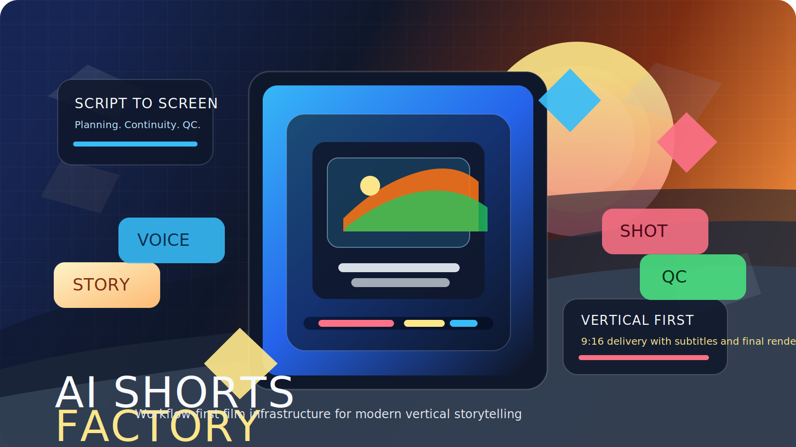

# AI Shorts Factory

[](LICENSE)
[](#quick-start)
[](#project-direction)



Open, workflow-first film infrastructure for turning a screenplay into a production-ready vertical short.

`AI Shorts Factory` is the public AGPL-3 codebase for Sanyo4ever Filmstudio. It is designed for teams that need more than one-off prompting: structured planning, character continuity, backend-aware generation, subtitle-safe composition, quality control, and final delivery in one reproducible system.

This repository was rebuilt from persistent project context after local data loss on 2026-03-11. The current codebase is a recovered workflow-first control plane for an animation assembly system with strong operator visibility, replay-friendly manifests, and a practical one-box runtime for local production.

> Internal agent memory, planning notes, and workspace-only context files stay private. The public repository is focused on runtime code, service integrations, scripts, tests, and operator-facing technical docs.

> Internal workspace and package name remain `sanyo4ever-filmstudio` while the public GitHub repository is positioned as `ai-shorts-factory`.

## Why This Repository Exists

- Turn scripts into finished short-form films through a governed multi-stage pipeline instead of a single brittle generation step.
- Keep story, character, shot, subtitle, and render decisions inspectable so teams can review, rerun, and improve output with control.
- Combine planning, media generation, orchestration, QC, and delivery into one system that is credible for real production workflows.

## What Is In The Repo Today

The current codebase restores:

- a public runtime codebase for the control plane, workers, adapters, and campaign tooling
- a FastAPI control-plane baseline
- local `SQLite`-backed runtime persistence
- deterministic planner, workflow engine, and media adapter contracts
- optional `Ollama` planner wiring through an explicit backend setting
- formal planning artifacts for `story_bible`, `character_bible`, `scene_plan`, `shot_plan`, `asset_strategy`, and `continuity_bible`
- a typed vertical composition contract per shot, including `framing`, `subject_anchor`, `eye_line`, `subtitle_lane`, and explicit `safe_zones` that now flow from planning into prompts and runtime manifests
- deterministic visual generation as the stable baseline plus opt-in `ComfyUI` wiring for character-package and storyboard stages
- live local Ukrainian TTS through `Piper` with the `uk_UA-ukrainian_tts-medium` voice pack
- deterministic music generation as the stable baseline plus opt-in `ACE-Step` wiring through a local HTTP service
- deterministic lipsync manifests as the stable baseline plus opt-in `MuseTalk` wiring for portrait dialogue shots with dedicated source generation
- deterministic local subtitles as the stable baseline plus opt-in `WhisperX` wiring through an isolated runtime env
- layout-aware subtitle artifacts with `ASS` burn-in and per-cue safe-zone geometry manifests for vertical shorts
- frame-diff subtitle visibility QC that samples cue boxes on `video_track` vs `subtitle_video_track` to confirm burned subtitles are visually present where the layout manifest expects them
- dedicated subtitle-lane campaign tooling for `hero_insert` top-lane verification, with per-run lane summaries and aggregate visibility reports
- real `FFmpeg` shot composition and final portrait render assembly with a default `720x1280` master profile
- `ffprobe`-backed QC on the produced media artifacts
- filesystem-backed GPU lease tracking for single-GPU scheduling visibility
- optional durable `Temporal` orchestration through a local dev server plus a dedicated worker that wraps the verified local pipeline
- project inspection endpoints for scenes, jobs, attempts, artifacts, QC, and recovery
- a local worker path that executes the rebuilt pipeline end to end in local live-backend mode where tools are available

## Project Direction

The system is intended to turn a screenplay into a finished animated film through a multi-stage pipeline:

`Script -> Story Bible -> Scene Plan -> Shot Plan -> Assets -> Voices -> Video Shots -> Lip Sync -> Music -> Edit -> QC -> Final Render`

The target architecture remains workflow-first, quality-first, and local self-hosted, with vertical `9:16` shorts as the default delivery profile, a preferred `720x1280` master render, strong observability across every stage, and no automatic quality-degrading fallbacks. Lower render or backend resolutions are allowed only through explicit configuration when this workstation needs them.

## License

This repository is licensed under the GNU Affero General Public License v3.0 (`AGPL-3.0`). If you modify the system and make it available over a network, the corresponding source for that modified version must remain available under the same license. See [LICENSE](LICENSE).

## Quick Start

```bash
python -m venv .venv
.venv\\Scripts\\activate
pip install -e .[dev]
uvicorn filmstudio.main:app --reload
```

Default mode keeps planning deterministic, uses local `Piper` for dialogue, uses deterministic subtitles, and relies on local `ffmpeg`/`ffprobe` for render and QC. To enable live planning through `Ollama`, set:

```bash
set FILMSTUDIO_PLANNER_BACKEND=ollama
set FILMSTUDIO_LLM_MODEL=llama3.1:8b
```

You can override planner, orchestrator, and media backend choice per project request by sending `planner_backend`, `planner_model`, `orchestrator_backend`, `visual_backend`, `video_backend`, `tts_backend`, `music_backend`, `lipsync_backend`, and `subtitle_backend` in the create-project payload.
`FILMSTUDIO_AUTO_MANAGE_SERVICES=1` is now the normal one-box runtime mode: the pipeline starts heavyweight local services on demand for the relevant stage, runs them sequentially, and performs a final cleanup sweep after the project run. Manual `start_*` scripts are now for debugging, warm-up, or isolated backend bring-up rather than for the default end-to-end path.
The default local render profile is now `FILMSTUDIO_RENDER_WIDTH=720`, `FILMSTUDIO_RENDER_HEIGHT=1280`, `FILMSTUDIO_RENDER_FPS=24`, so fresh projects plan and render as vertical shorts unless you override those settings explicitly.

Default TTS uses local `Piper` with the checked-in runtime model path under `runtime/models/piper/...`.
The dialogue manifest now persists both original script text and the actual `tts_input_text` sent to `Piper`; for `language=uk`, the backend normalizes Ukrainian Latin-script dialogue into Cyrillic lowercase before synthesis so mixed-script operator input does not leak directly into the TTS engine.
`Chatterbox` is now also wired as an explicit opt-in `tts_backend=chatterbox`. The repo now carries `scripts/bootstrap_chatterbox.ps1` and `scripts/start_chatterbox.ps1` for reproducible bring-up, the runtime probe now reports both `chatterbox` HTTP reachability and `chatterbox_env` facts, and a live local `language=en` pipeline smoke has now completed with `tts_backend=chatterbox` and `QC passed`. The dialogue manifest persists the exact `tts_request`, compact `tts_response`, selected predefined voice, and `tts_runtime.model_info` returned by the live `Chatterbox` service for replay-friendly debugging. `Piper` remains the stable default because the currently verified local `Chatterbox` model path is `ChatterboxTurboTTS`, which only advertises `en` support and is not suitable as the default Ukrainian path.
Deterministic sine-wave music remains the stable default. `ACE-Step` is now a verified explicit opt-in `music_backend=ace_step` through its local async HTTP API. The runtime probe now reports `ace_step`, `ace_step_env`, and `ace_step_runtime`, and the rebuilt `generate_music` stage persists per-cue `music_generation_manifest` files plus an aggregate `music_manifest.json` with the exact request payload, task id, polling history, selected result payload, downloaded file metadata, and service-side health/models/stats snapshots. The repo now carries `scripts/bootstrap_ace_step.ps1`, `scripts/start_ace_step.ps1`, and `scripts/resume_ace_step_download.py` for reproducible bring-up and checkpoint prefetch; the local path is pinned to `HF_HUB_DISABLE_XET=1` plus `HF_HUB_ENABLE_HF_TRANSFER=1` because local xet-based resume hit `416 Range Not Satisfiable` while the HTTP path completed successfully. A direct live `ACE-Step` generation smoke now succeeds on this workstation, the client now falls back to `ffprobe` for float-PCM `wav` outputs that stdlib `wave` cannot parse, and a fresh full local pipeline smoke has already completed with `music_backend=ace_step` and `QC passed`. `ACE-Step` remains opt-in even after that verification so the stable default path stays predictable while broader live music campaigns are still pending.
`WhisperX` is installed in `runtime/envs/whisperx`, and the runtime probe now reports that env separately. On this workstation it is still CPU-only (`torch 2.8.0+cpu`), but the explicit opt-in `subtitle_backend=whisperx` path has now passed a live end-to-end smoke and persists `subtitles/whisperx_manifest.json` plus the raw backend JSON for debugging. Deterministic subtitles remain the stable default because the current `WhisperX` profile is too slow to make the baseline pipeline depend on it.
`ComfyUI` is now wired as an explicit opt-in visual backend for `build_characters` and `generate_storyboards`. The repo also carries `scripts/bootstrap_comfyui.ps1` and `scripts/start_comfyui.ps1` for local bring-up. On this workstation the dedicated `ComfyUI` env is now GPU-enabled (`torch 2.10.0+cu130`), the local API is reachable, `v1-5-pruned-emaonly-fp16.safetensors` is installed under `runtime/services/ComfyUI/models/checkpoints/`, and both client-level and pipeline-level `visual_backend=comfyui` smokes have passed. Deterministic visual generation remains the stable default, but `ComfyUI` is now a verified live opt-in backend here.
`Wan2.1` is now wired as an explicit opt-in `video_backend=wan` for `hero_insert` shots in `render_shots`. On this one-box runtime it is intentionally integrated as an on-demand CLI backend instead of another always-on HTTP service: hero shots call the upstream `generate.py`, persist `shot_video_backend_raw`, normalize the result into the canonical `shot_video`, and write a replay-friendly `shot_render_manifest` with task, checkpoint dir, prompt, input mode, stdout/stderr paths, raw probe, normalization command, and `wan_profile_summary`. The repo now carries `scripts/bootstrap_wan.ps1`, `scripts/download_wan_weights.py`, `scripts/download_wan_weights.ps1`, `scripts/run_wan_smoke.py`, `scripts/run_wan_smoke.ps1`, `scripts/profile_wan_smoke.py`, `scripts/profile_wan_smoke.ps1`, `scripts/run_wan_hero_shot_sweep.py`, `scripts/patch_wan_attention_fallback.py`, `scripts/patch_wan_profiling.py`, `scripts/patch_wan_t5_padding.py`, `scripts/patch_wan_vae_runtime.py`, and `scripts/patch_wan_model_release.py`. The local `Wan` repo and dedicated env now exist under `runtime/services/Wan2.1` and `runtime/envs/wan`, and the env is GPU-enabled on this workstation (`torch 2.5.1+cu121`, CUDA available). The default local portrait-first `Wan` profile is now `task=t2v-1.3B`, `size=480*832`, checkpoint dir `runtime/models/wan/Wan2.1-T2V-1.3B`, with workstation-oriented defaults `FILMSTUDIO_WAN_OFFLOAD_MODEL=0`, `FILMSTUDIO_WAN_T5_CPU=0`, and `FILMSTUDIO_WAN_VAE_DTYPE=bfloat16`. The bootstrap now reapplies the local SDPA fallback patch in `wan/modules/attention.py`, the Filmstudio profiling hooks in `wan/text2video.py` plus `wan/image2video.py`, the local T5 dynamic-padding patch, the Filmstudio `VAE` dtype plus decode-profiling patch, and the one-box model-release patch that unloads `T5`, `CLIP`, and `DiT` before later stages when they are no longer needed. `Wan` command logs are now file-backed live during execution rather than only after process exit, timeout failures now kill the full process tree and persist `wan_failure.json` with `timed_out=true`, and every debug run now writes `wan_profile.jsonl` plus `wan_profile_summary.json`; the runner now merges file-trace metrics back into the persisted summary so operator reports keep `pipeline_create`, `text_encoder_call`, and `vae_chunk` data on successful runs too. The lower-res vertical path is no longer blocked in `vae_decode`: fresh live smokes on `2026-03-13` now complete `t2v-1.3B @ 480*832` end to end under `offload_model=false`, `t5_cpu=false`, and `vae_dtype=bfloat16`, with the strongest verified local diagnostic profile around `pipeline_create ≈ 153s`, `text_encode ≈ 15.5s`, `sampling_total ≈ 3.9s`, `vae_decode ≈ 16.3s`, and a real `smoke.mp4` output. A fresh `Wan` hero-shot campaign under `runtime/campaigns/wan_hero_shot_campaign_v5_green/` also completed `1/1` with `status=completed`, `QC passed`, `duration_alignment_rate=1.0`, and `qc_finding_counts={}` after the planner tightened `hero_insert` duration budgets and the normalize step gained a duration-aware last-frame hold policy for very short raw clips. The older higher-quality `i2v-14B @ 720*1280` track remains a separate R&D path and is still blocked on this workstation by the upstream native abort during model load.
`Wan` now also has a dedicated budget-ladder operator path through `scripts/run_wan_budget_ladder.py`. Earlier live runs under `runtime/campaigns/wan_budget_ladder_v1/` established the first honest ladder on this workstation with `f05_s02` and `f09_s02`, and later single-profile runs also verified `f09_s04` and `f13_s02`. After tightening deterministic planner routing for transliterated action-heavy hero shots, the fresh all-cases rerun under `runtime/campaigns/wan_budget_ladder_v6_f13_s04_all_cases_fixed/` completed `3/3` with `QC passed`, `wan_shot_count=3`, `expected_strategy_only_run_rate=1.0`, and `qc_finding_counts={}`. The current strongest successful verified local profile is therefore `f13_s04` for the lower-res portrait `t2v-1.3B @ 480*832` path, and that budget is now also the default one-box runtime profile instead of only a campaign override: fresh plain `scripts/run_wan_smoke.py` runs now use `13` frames and `4` sampling steps without extra `WAN_*` env overrides. The heavier `i2v-14B @ 720*1280` branch was rechecked on `2026-03-13` with a minimal `5`-frame, `2`-step image-input smoke and still aborts with exit code `3221225477` during `pipeline_create` while loading `WanModel` checkpoint shards, so it remains an explicit R&D blocker rather than a silently assumed upgrade path. The ladder report keeps per-profile subreports under `runtime/campaigns/<campaign>/profiles/` and adds a top-level answer for `best_successful_profile` versus `strongest_attempted_profile`, which is the current operator-facing way to decide how far this `RTX 4060` can be pushed honestly.
`MuseTalk` is now wired as an explicit opt-in lipsync backend for `apply_lipsync`. The repo now carries `scripts/bootstrap_musetalk.ps1` and `scripts/run_musetalk_smoke.ps1` for reproducible bring-up and upstream sample validation. On this workstation the dedicated `MuseTalk` env is now GPU-enabled (`torch 2.0.1+cu118`, CUDA available), the required `mmcv`/`mmdet`/`mmpose` stack is installed, the upstream model layout under `runtime/services/MuseTalk/models/` is complete enough for `v15` inference, and both the official sample inference and full local pipeline smokes have now produced valid `mp4` outputs. The live project-shot path now generates a dedicated `ComfyUI` talking-head source image from the already-generated character reference via `img2img`, stages that reference under `runtime/services/ComfyUI/input`, runs each candidate source through a dedicated `MuseTalk` source-face preflight, applies deterministic detector-relief padding when landmark geometry survives but detector readiness collapses, applies deterministic crop-tightening when the source face is valid but too small for the preferred occupancy target, escalates that crop into `occupancy_plus_isolation` mode when a secondary face dominates the frame, and routes geometry-valid size-only preflight failures into that same recovery chain instead of rejecting them immediately. The preferred first source variant is now `studio_headshot`; `direct_portrait` and `passport_portrait` remain only as later retries. The probe contract now persists both normalized `effective_pass` and stricter `source_inference_ready`, plus `source_face_isolation` and `output_face_isolation`, so retry/QC logic can distinguish geometry salvage from detector-readiness problems. The final lipsync manifest now carries structured `source_input_mode`, `source_attempts`, `source_preflight_recoverable`, `source_probe`, `source_face_probe`, `source_inference_ready`, `source_detector_adjustment`, `source_face_quality`, `source_face_occupancy`, `source_face_isolation`, `source_occupancy_adjustment`, `source_vs_output_face_delta`, `output_face_probe`, `output_face_quality`, `output_face_isolation`, `output_face_samples`, `output_face_sequence_quality`, and `output_face_temporal_drift` data so QC can validate both the portrait source and the generated talking-head output with explicit warn and reject thresholds plus a dominant drift metric and raw per-metric span summaries. A fresh `3`-case portrait stability campaign under `runtime/campaigns/portrait_stability_campaign_v5/` completed with `3/3` runs `QC passed`, no QC findings, `first_attempt_success_rate=1.0`, and `selected_prompt_variant=studio_headshot` on all selected portrait shots. Deterministic lipsync manifests remain the stable default because `MuseTalk` is still an explicit opt-in backend rather than the process-wide baseline.

Run the local worker pipeline:

```bash
python scripts/run_local_worker.py <project_id>
```

Run a dedicated `hero_insert` top-lane subtitle campaign:

```bash
python scripts/run_top_subtitle_lane_sweep.py --campaign-name top_subtitle_lane_campaign_v2 --limit 3
```

The dedicated campaign writes a report under `runtime/campaigns/<campaign_name>/stability_report.json` and now tracks `subtitle_summary.lane_counts`, `strategy_counts`, sampled visibility counts, and the resolved final render path from the real `final_video` artifact. A fresh live run under `runtime/campaigns/top_subtitle_lane_campaign_v3/` completed `3/3` with `expected_lane=top`, `expected_lane_visible_rate=1.0`, and `qc_finding_counts={}`. The deterministic top-lane path now drops redundant speaker prefixes for `hero_insert` captions, carries `recommended_max_lines=3` in the layout manifest for that action-specific lane, and the QC `duration_mismatch` rule now compares final render duration against the planned shot timeline instead of the shorter dialogue bus.

Run a dedicated `Wan` hero-shot campaign:

```bash
python scripts/run_wan_hero_shot_sweep.py --campaign-name wan_hero_shot_campaign_v2_diag --limit 1 --frame-num 9
```

The dedicated `Wan` campaign writes a report under `runtime/campaigns/<campaign_name>/stability_report.json` and now aggregates `wan_shots` from `shot_render_manifest` files: task counts, size counts, input-mode counts, raw and normalized resolutions, target-resolution matches, duration-alignment rates, and profiling summaries such as `profile_status_counts`, `profile_last_phase_counts`, and `profile_completed_step_count`. If a run times out, the campaign still returns a structured report plus live-written `wan_stdout.log`, `wan_stderr.log`, `wan_failure.json`, and the `wan_profile.jsonl` or `wan_profile_summary.json` pair for the failed shot. For shorter local diagnostics you can combine the script with environment overrides such as `FILMSTUDIO_WAN_SAMPLE_STEPS`, `FILMSTUDIO_WAN_TIMEOUT_SEC`, and `FILMSTUDIO_WAN_PROFILE_SYNC_CUDA=1`.

Run a sequential `Wan` budget-ladder campaign:

```bash
python scripts/run_wan_budget_ladder.py --campaign-name wan_budget_ladder_v1 --limit 1 --frame-nums 5,9 --sample-steps 2 --timeout-sec 900 --profile-sync-cuda
```

The ladder runner evaluates multiple `Wan` budgets sequentially, writes per-profile reports under `runtime/campaigns/<campaign_name>/profiles/`, and then writes a top-level report with `green_profile_count`, `best_successful_profile`, and `strongest_attempted_profile`. This is the current operator-facing surface for answering which `Wan` budget is the strongest one that actually passes on this workstation.

`run_local_worker.py` now honors the configured `lipsync_backend` and `MuseTalk` runtime settings in the same way as the API/inline worker wiring, so CLI smoke runs are valid end-to-end backend checks instead of a reduced profile.

Inspect the currently configured runtime and backend reachability:

```bash
python scripts/inspect_runtime.py
```

Stop all heavyweight managed services manually if you have been doing backend bring-up or smoke tests outside the normal project runner:

```powershell
powershell -ExecutionPolicy Bypass -File .\scripts\stop_managed_services.ps1
```

Bootstrap or run the local `ComfyUI` service manually for debugging:

```powershell
powershell -ExecutionPolicy Bypass -File .\scripts\bootstrap_comfyui.ps1
powershell -ExecutionPolicy Bypass -File .\scripts\start_comfyui.ps1 -Detach -ForceRestart
```

`start_comfyui.ps1` now launches the service with file-backed stdout and stderr logs under `runtime/logs/comfyui/` and writes `runtime/logs/comfyui/latest.json` with the active listener pid and log paths.

Bootstrap or run the local `Chatterbox` service manually for debugging:

```powershell
powershell -ExecutionPolicy Bypass -File .\scripts\bootstrap_chatterbox.ps1
powershell -ExecutionPolicy Bypass -File .\scripts\start_chatterbox.ps1 -Detach -ForceRestart
```

`start_chatterbox.ps1` now launches the service with file-backed stdout and stderr logs under `runtime/logs/chatterbox/`, writes `runtime/logs/chatterbox/latest.json`, and keeps the service aligned with `FILMSTUDIO_CHATTERBOX_BASE_URL`.

Bootstrap or run the local `ACE-Step` service manually for debugging:

```powershell
powershell -ExecutionPolicy Bypass -File .\scripts\bootstrap_ace_step.ps1
powershell -ExecutionPolicy Bypass -File .\scripts\start_ace_step.ps1 -Detach -ForceRestart -NoInit
```

`start_ace_step.ps1` launches the local API server on `http://127.0.0.1:8002` by default, writes file-backed stdout and stderr logs under `runtime/logs/ace_step/`, and records `runtime/logs/ace_step/latest.json` with the active listener pid, selected DiT/LM config, and readiness result. Remove `-NoInit` when you want the service to load models at startup instead of lazily on first request.
On the first full startup without `-NoInit`, use `python .\scripts\resume_ace_step_download.py` if you want to prefetch the missing main checkpoints before the service tries to load them. The local launcher now disables xet and enables `hf_transfer` by default because that path proved more reliable on this workstation than the first xet-based resume attempt.

Bootstrap or validate the local `MuseTalk` runtime:

```powershell
powershell -ExecutionPolicy Bypass -File .\scripts\bootstrap_musetalk.ps1
powershell -ExecutionPolicy Bypass -File .\scripts\run_musetalk_smoke.ps1 -UseFloat16
```

Bootstrap or validate the local `Wan` runtime:

```powershell
powershell -ExecutionPolicy Bypass -File .\scripts\bootstrap_wan.ps1
powershell -ExecutionPolicy Bypass -File .\scripts\download_wan_weights.ps1
powershell -ExecutionPolicy Bypass -File .\scripts\run_wan_smoke.ps1
powershell -ExecutionPolicy Bypass -File .\scripts\profile_wan_smoke.ps1
```

The Windows bootstrap now intentionally skips upstream `flash_attn` because that package is not a stable requirement for this workstation path and failed here under the raw upstream requirement set. The bootstrap also pins the `Wan` env to GPU-enabled `torch 2.5.1+cu121`, installs `einops`, installs explicit Hugging Face download tooling instead of accepting the default CPU wheel or incomplete dependency set from the general Python index, reapplies the local SDPA fallback patch that makes the lower-res portrait `T2V-1.3B` path viable here, and reapplies the Filmstudio profiling patch so `Wan` timeout diagnostics stay reproducible after any upstream pull.

Bootstrap or run the local `Temporal` orchestration runtime manually for debugging:

```powershell
powershell -ExecutionPolicy Bypass -File .\scripts\bootstrap_temporal.ps1
powershell -ExecutionPolicy Bypass -File .\scripts\start_temporal.ps1 -Detach -ForceRestart
powershell -ExecutionPolicy Bypass -File .\scripts\start_temporal_worker.ps1 -Detach -ForceRestart
```

The `Temporal` path is now a verified live opt-in `orchestrator_backend=temporal` on this workstation. `start_temporal.ps1` writes `runtime/logs/temporal/latest.json`, `start_temporal_worker.ps1` writes `runtime/logs/temporal_worker/latest.json`, and project metadata now persists `temporal_workflow.workflow_id`, `run_id`, `namespace`, `task_queue`, and final activity result for replay-friendly debugging.
The runtime now also honors `orchestrator_backend` per project through a dispatching worker rather than only from process-wide settings. The `Temporal` code path is now decomposed into project, scene, and shot child workflows with persisted progress under `project.metadata.temporal_workflow.progress`, and that refactored path has now been re-verified live on this workstation through a fresh detached-worker smoke with persisted child-workflow results.
`Temporal` projects now also get an initialized `temporal_workflow.status=not_started` record at create time, and the API exposes a normalized orchestration read-model at `GET /api/v1/projects/{project_id}/temporal` so operators can inspect project-level status, scene/shot workflow state, and persisted progress events without spelunking raw metadata blobs. That endpoint derives a stable scene/shot view from both persisted workflow progress and the snapshot topology, so sparse progress metadata still yields a complete operator-facing status tree.

You can also point the runtime probe at a specific WhisperX python env if needed:

```bash
set FILMSTUDIO_WHISPERX_PYTHON_BINARY=runtime\\envs\\whisperx\\Scripts\\python.exe
```

GPU lease timing and persistence for the local single-card scheduler can be tuned through:

```bash
set FILMSTUDIO_GPU_LEASE_ROOT=runtime\\manifests\\gpu_leases
set FILMSTUDIO_GPU_LEASE_HEARTBEAT_SEC=5.0
set FILMSTUDIO_GPU_LEASE_STALE_TIMEOUT_SEC=120.0
set FILMSTUDIO_GPU_LEASE_WAIT_TIMEOUT_SEC=300.0
```

## Current API Surface

- `GET /health/live`
- `GET /health/ready`
- `GET /health/services`
- `GET /health/backends`
- `GET /health/resources`
- `POST /api/v1/projects`
- `GET /api/v1/projects`
- `GET /api/v1/projects/{project_id}`
- `GET /api/v1/projects/{project_id}/planning`
- `GET /api/v1/projects/{project_id}/temporal`
- `GET /api/v1/projects/{project_id}/scenes`
- `GET /api/v1/projects/{project_id}/jobs`
- `GET /api/v1/projects/{project_id}/job-attempts`
- `GET /api/v1/projects/{project_id}/job-attempts/{attempt_id}`
- `GET /api/v1/projects/{project_id}/job-attempts/{attempt_id}/logs`
- `GET /api/v1/projects/{project_id}/job-attempts/{attempt_id}/manifest`
- `GET /api/v1/projects/{project_id}/artifacts`
- `POST /api/v1/projects/{project_id}/run`
- `GET /api/v1/projects/{project_id}/qc-reports`
- `GET /api/v1/projects/{project_id}/recovery-plans`

## Recovery Note

Historical context contains many more integrations and validation milestones than the rebuilt code currently implements. The current pipeline now mixes deterministic planning/assets with live local `FFmpeg` render and `ffprobe` QC, plus verified live opt-in paths for `ComfyUI`, `Chatterbox`, `WhisperX`, `MuseTalk`, `ACE-Step`, and `Temporal`, and a partly promoted `Wan2.1` hero-shot path: the lower-res portrait `t2v-1.3B @ 480*832` route is operational on this workstation after the local attention fallback patch, while the higher-quality `i2v-14B @ 720*1280` path still aborts natively during model load. Treat the docs as the target state and the rebuilt code as a strongly structured base for finishing the remaining `Wan2.1` runtime debugging or alternative execution-path bring-up and for deepening `Temporal` through stronger scene/shot recovery semantics, richer queue-aware worker decomposition, and a better operator surface.

`/health/resources` now includes live `nvidia-smi` GPU telemetry plus the current active GPU leases, and GPU-bound stage manifests persist both `gpu_lease` and `gpu_lease_release` metadata alongside the before/after snapshots.
